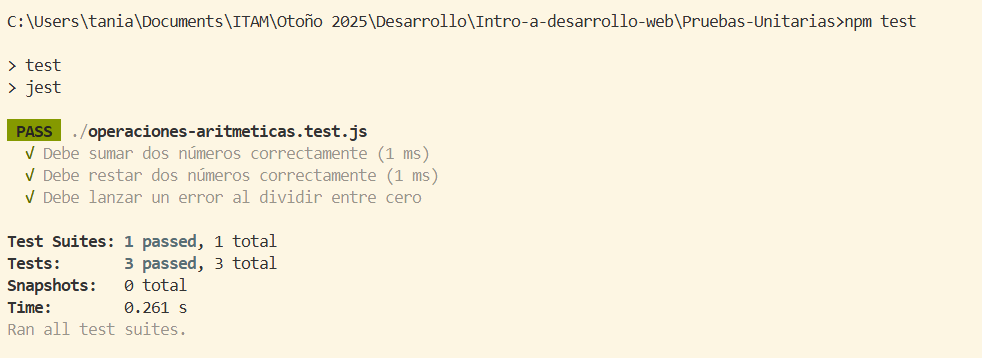
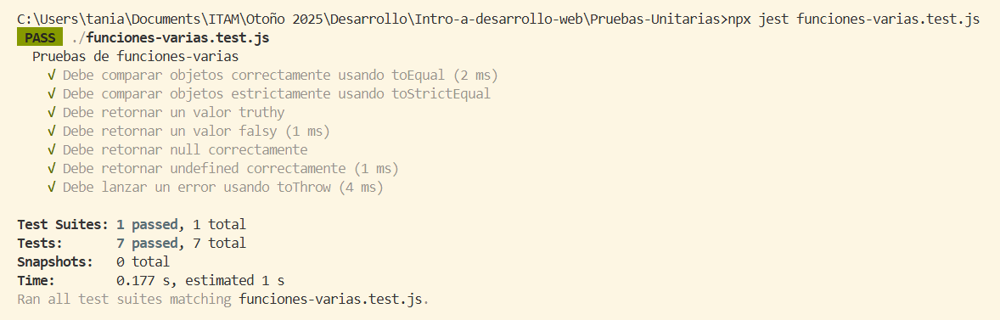

# Investigación Pruebas Unitarias
Tania Mendoza González | 
Introducción al Desarrollo web

## Pruebas Unitarias y verificaciones
En las pruebas unitarias con Jest, el método principal que se usa para validar resultados es expect().
 Este método recibe un valor generado por alguna función o proceso, y después se combina con distintas verificaciones 
 (como .toEqual() o .toBeTruthy()) que sirven para comprobar si el valor cumple cierta condición. Cada verificación 
 representa un tipo diferente de verificación, por lo que conocerlas permite hacer pruebas más completas y detectar 
 errores con mayor precisión.

## .toEqual()
Se usa para comparar que dos valores tengan el mismo contenido interno, especialmente cuando 
se trata de objetos o arreglos. No requiere que ambos sean exactamente el mismo objeto en memoria, solo 
que tengan las mismas propiedades y valores.
```
expect(valorActual).toEqual(valorEsperado);
```

## .toBeTruthy()
Verifica que el valor pueda interpretarse como verdadero en JavaScript. No tiene que ser true específicamente, basta con que no sea un valor “falso”.
```
expect(valor).toBeTruthy();
```

## .toBeFalsy()
Valida que el valor sea considerado falso por JavaScript. Esto incluye 0, "", null, undefined, false y NaN.
```
expect(valorActual).toBeFalsy();
```

## .toBeNull()
Comprueba que el valor sea exactamente null.
```
expect(valorActual).toBeNull();
```
## .toBeUndefined()
Valida que el valor sea exactamente undefined, como cuando una variable no tiene asignación o una función no retorna nada.
```
expect(valorActual).toBeUndefined();
```
## .toThrow()
se utiliza para verificar que una función lance un error al ejecutarse. Esto permite comprobar el manejo adecuado de errores y excepciones.
```
expect(() => funcionQueDebeFallar()).toThrow();
```

## .toStrictEqual()
Compara valores complejos de manera más estricta que .toEqual(). Además de revisar el contenido, también verifica tipos, propiedades adicionales o faltantes y valores undefined definidos explícitamente.
```
expect(valorActual).toStrictEqual(valorEsperado);
```

# Ejercicios y Pruebas

## Ejercicio de clase

En clase, hicimos dos archivos para experimentar con expect() y pruebas unitarias.
A continuación, hablaremos un poco de cada uno, y adjuntaremos una imagen del test.
Todos los códigos se encuentran en esta carpeta.

### operaciones-aritmeticas.js
Este archivo define varias funciones que realizan operaciones aritméticas básicas: sumar, restar, multiplicar, dividir y obtener el módulo de dos números. La función dividir incluye una validación que lanza un error cuando el divisor es cero, evitando cálculos inválidos. Además, se incluye la función operar, que permite seleccionar la operación deseada mediante un parámetro de texto, centralizando la lógica en un solo punto. Finalmente, todas las funciones se exportan para ser utilizadas en otros archivos.

### operaciones-aritmeticas.test.js
Este archivo contiene pruebas unitarias que validan el funcionamiento de las funciones importadas desde el módulo de operaciones. Se verifica que sumar y restar retornen resultados correctos para distintos valores, mientras que la prueba de división confirma que la función dividir genera un error apropiado al intentar dividir entre cero. Estas pruebas permiten asegurar que las funciones matemáticas se comportan de manera correcta y consistente en diferentes escenarios.

### Ejecución


## Ejercicios de Tarea 
Para esta tarea, probamos de distintas formas los conceptos que investigamos.
A continuación, se muestran las modificaciones y pruebas solicitadas en la tarea.

### Prueba unitaria de división entre cero con .toThrow()
Agregamos la siguiente prueba a operaciones-aritmeticas.test.js:
```
test("Debe lanzar un error al dividir entre cero usando toThrow", () => {
  expect(() => dividir(10, 0)).toThrow("No se puede dividir entre cero :(");
});
```


### funciones-varias.js
Este archivo define varias funciones diseñadas específicamente para probar diferentes tipos de verificaciones en Jest. Cada función retorna un valor particular con el propósito de permitir el uso y demostración de los métodos de verificación que investigamos. Es una base práctica para experimentar y validar el comportamiento de cada método de prueba.

### funciones-varias.test.js
Este archivo contiene un conjunto de pruebas unitarias diseñadas para validar el comportamiento de las funciones definidas en funciones-varias.js. Cada prueba utiliza un método diferente de Jest, lo que permite comprobar distintos tipos de resultados: desde la comparación de objetos hasta la verificación de valores booleanos y el manejo correcto de errores. 

### Ejecución


